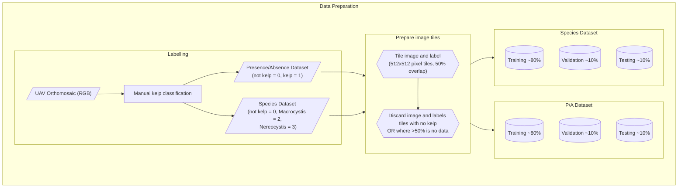
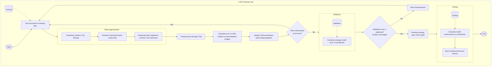

# About

This document gives information about interpreting the Kelp-O-Matic model outputs, and
gives details on the dataset pre-processing workflow, model training, and final
performance achieved for both the kelp and mussel detection models.

## Model Outputs

Each of the Kelp-O-Matic models outputs a mask raster with integer pixel values that
represent the following classes:

### Kelp

These are the outputs from the `find-kelp` routine:

| Output value | Class                        |
|-------------:|------------------------------|
|        **0** | Background                   |
|        **1** | Kelp *(presence mode)*       |
|        **2** | Macrocystis *(species mode)* |
|        **3** | Nereocystis *(species mode)* |

### Mussels

These are the outputs from the `find-mussels` routine:

| Output value | Class      |
|-------------:|------------|
|        **0** | Background |
|        **1** | Mussles    |

## Dataset Preparation

The datasets used to train the kelp segmentation model were a number of scenes collected
using DJI Phantom remotely-piloted aircraft systems (RPAS). A total of 28 image mosaic
scenes were used. The resolution of each image varied between 0.023m and 0.428m, with
an average of 0.069m and standard deviation of 0.087m. These images were collected over
a period from 2018 to 2021, all during summer.

For model training, each dataset was divided into 512 pixels square cropped sections,
with 50% overlap between adjacent tiles. To balance the dataset, tiles containing no
kelp where discarded. These sets of tiles where then divided into training, validation,
and test splits.

Source code for data preparation is available on GitHub
at [:material-github: hakai-ml-dataprep](https://github.com/tayden/hakai-ml-dataprep).

### Pre-processing overview

### Dataset summaries

**Kelp (presence/absence)**

| Split      | Scenes |  Tiles | Pixels~kelp~ | Pixels~total~ | Area (km^2^) | Res~max~ (m) | Res~min~ (m) | Res~$\mu$~ (m) | Res~$\sigma$~ (m) |
|:-----------|-------:|-------:|-------------:|--------------:|-------------:|-------------:|-------------:|---------------:|------------------:|
| Train      |     20 | 829404 | 216770596954 |    3738528864 |     11680.54 |       0.1040 |       0.0230 |         0.0487 |            0.0253 |
| Validation |      4 |  31610 |   8220459464 |     295310084 |       253.79 |       0.0420 |       0.0230 |         0.0296 |            0.0085 |
| Test       |      6 |  92608 |  24093604354 |     639694012 |       819.45 |       0.0680 |       0.0230 |         0.0385 |            0.0161 |
| *Sum*      |     30 | 953622 | 249084660772 |    4673532960 |    12,753.78 |

**Kelp (species)**

| Split      | Scenes |  Tiles | Pixels~macro~ | Pixels~nereo~ | Pixels~total~ | Area (km^2^) | Res~max~ (m) | Res~min~ (m) | Res~$\mu$~ (m) | Res~$\sigma$~ (m) |
|:-----------|-------:|-------:|--------------:|--------------:|--------------:|-------------:|-------------:|-------------:|---------------:|------------------:|
| Train      |     17 | 336740 |     605462674 |    1158650042 |   88008624978 |      4034.11 |       0.1040 |       0.0230 |         0.0488 |            0.0266 |
| Validation |      4 |  15805 |     127410722 |      20244320 |    4110229732 |       123.91 |       0.0420 |       0.0230 |         0.0296 |            0.0085 |
| Test       |      6 |  46304 |     143277498 |     176569508 |   12046802177 |       409.72 |       0.0680 |       0.0230 |         0.0385 |            0.0161 |
| *Sum*      |     27 | 398849 |     876150894 |    1355463870 |  104165656887 |      4567.75 |              |              |                |                   |

**Mussels (presence/absence)**

| Split      | Scenes | Tiles | Pixels~mussels~ | Pixels~total~ | Area (km^2^) | Res~max~ (m) | Res~min~ (m) | Res~$\mu$~ (m) | Res~$\sigma$~ (m) |
|:-----------|-------:|------:|----------------:|--------------:|-------------:|-------------:|-------------:|---------------:|------------------:|
| Train      |     39 |  4834 |       933287123 |    5068816384 |      23.8147 |        0.027 |      0.00231 |      0.0082244 |        0.00492054 |
| Validation |      8 |  1277 |       223598444 |    1339031552 |      5.74255 |   0.00518591 |   0.00330667 |     0.00421985 |       0.000545617 |
| Test       |      8 |  1110 |       175226412 |    1163919360 |      4.64052 |   0.00578278 |     0.003671 |     0.00435929 |       0.000665025 |
| *Sum*      |     55 |  7221 |      1332111979 |    7571767296 |    34.197799 |     0.037969 |     0.009288 |       0.016804 |          0.006131 |

## Model Training

Source code for model training is available on GitHub
at [:material-github: hakai-ml-train](https://github.com/tayden/hakai-ml-train).

### Training overview

## Model Performance

### Metric definitions

The following definitions describe the metrics used during training and evaluation of
the deep neural networks. They are important to understand for the sections following.

**Definitions in terms of pixel sets:**

- Let $A$ equal the set of human-labelled pixels.
- Let $B$ be defined as the set of pixel labels predicted by the model.
- Let $A_i$ and $B_i$ be the sets of pixels for a particular class of interest, $i$,
  from labels $A$ and $B$, respectively.

**Definitions in terms of true and false postive/negative classes:**

For class $i$:

- Let $TP_i$ be the true positives.
- Let $FP_i$ be the false positives.
- Let $TN_i$ be the true negatives.
- Let $FN_i$ be the false negatives.

**IoU**

:   The "intersection over union", also called the "Jaccard Index". Defined as:

$$
IoU_i (A,B) = \frac{|A_i \cap B_i|}{|A_i \cup B_i|} = \frac{TP_i}{TP_i + FP_i + FN_i}
$$

**Precision**

:   The ratio of correct predictions for a class to the count of predictions of that
class:

$$
Precision_i = \frac{|A_i \cap B_i|}{|A_i|} = \frac{TP_i}{TP_i + FP_i}
$$

**Recall**

:   The ratio of correct predictions for a class to the count of actual instances of
that class:

$$
Recall_i = \frac{|A_i \cap B_i|}{|B_i|} = \frac{TP_i}{TP_i + FN_i}
$$

**Accuracy**

:   The ratio of counts of pixels correctly classified by the model divided over the
total number of pixels.

$$
Accuracy = \frac{TP + TN}{TP + TN + FP + FN}
$$

### Summary statistics

**Kelp (presence/absence)**

=== "RGB"

    === "Test split"

        | Class    |    IoU | Precision | Recall | Accuracy |
        |:---------|-------:|----------:|-------:|---------:|
        | Kelp     | 0.7455 |    0.7844 | 0.9376 |        - |
        | Not Kelp | 0.9891 |    0.9979 | 0.9912 |        - |
        | *Mean*   | 0.8673 |    0.8911 | 0.9644 |   0.9894 |

    === "Validation split"

        | Class    |    IoU | Precision | Recall | Accuracy |
        |:---------|-------:|----------:|-------:|---------:|
        | Kelp     | 0.7293 |    0.8606 | 0.8269 |        - |
        | Not Kelp | 0.9617 |    0.9780 | 0.9829 |        - |
        | *Mean*   | 0.8455 |    0.9193 | 0.9049 |   0.9653 |

    === "Train split"

        | Class    |    IoU | Precision | Recall | Accuracy |
        |:---------|-------:|----------:|-------:|---------:|
        | Kelp     | 0.7927 |    0.8631 | 0.9066 |        - |
        | Not Kelp | 0.9763 |    0.9905 | 0.9855 |        - |
        | *Mean*   | 0.8845 |    0.9268 | 0.9461 |   0.9782 |

=== "RGBI"

    === "Test split"

        | Class    |    IoU | Precision | Recall | Accuracy |
        |:---------|-------:|----------:|-------:|---------:|
        | Kelp     | 0.7093 |    0.7669 | 0.9039 |        - |
        | Not Kelp | 0.9867 |    0.9968 | 0.9898 |        - |
        | *Mean*   | 0.8480 |    0.8818 | 0.9469 |   0.9872 |

    === "Validation split"

        | Class    |    IoU | Precision | Recall | Accuracy |
        |:---------|-------:|----------:|-------:|---------:|
        | Kelp     | 0.7756 |    0.8607 | 0.8925 |        - |
        | Not Kelp | 0.9882 |    0.9929 | 0.9953 |        - |
        | *Mean*   | 0.8819 |    0.9268 | 0.9439 |   0.9889 |

    === "Train split"

        | Class    |    IoU | Precision | Recall | Accuracy |
        |:---------|-------:|----------:|-------:|---------:|
        | Kelp     | 0.7523 |    0.8932 | 0.8259 |        - |
        | Not Kelp | 0.9894 |    0.9931 | 0.9963 |        - |
        | *Mean*   | 0.8709 |    0.9111 | 0.9432 |   0.9901 |

**Kelp (species)**

=== "RGB"

    === "Test split"

        | Class    |    IoU | Precision | Recall | Accuracy |
        |:---------|-------:|----------:|-------:|---------:|
        | Macro    | 0.7057 |    0.7997 | 0.8571 |        - |
        | Nereo    | 0.6324 |    0.6902 | 0.8829 |        - |
        | Not Kelp | 0.9861 |    0.9948 | 0.9912 |        - |
        | *Mean*   | 0.7747 |    0.8283 | 0.9104 |   0.9865 |

    === "Validation split"

        | Class    |    IoU | Precision | Recall | Accuracy |
        |:---------|-------:|----------:|-------:|---------:|
        | Macro    | 0.5205 |    0.8574 | 0.5698 |        - |
        | Nereo    | 0.6200 |    0.8319 | 0.7087 |        - |
        | Not Kelp | 0.9315 |    0.9460 | 0.9838 |        - |
        | *Mean*   | 0.6906 |    0.8784 | 0.7541 |   0.9359 |

    === "Train split"

        | Class    |    IoU | Precision | Recall | Accuracy |
        |:---------|-------:|----------:|-------:|---------:|
        | Macro    | 0.7279 |    0.8905 | 0.7994 |        - |
        | Nereo    | 0.7595 |    0.8421 | 0.8857 |        - |
        | Not Kelp | 0.9685 |    0.9836 | 0.9844 |        - |
        | *Mean*   | 0.8186 |    0.9054 | 0.8898 |   0.9707 |

=== "RGBI"

    === "Test split"

        | Class    |    IoU | Precision | Recall | Accuracy |
        |:---------|-------:|----------:|-------:|---------:|
        | Nereo    | 0.6481 |    0.7492 | 0.8263 |        - |
        | Macro    | 0.7137 |    0.7470 | 0.9413 |        - |
        | Not Kelp | 0.9867 |    0.9968 | 0.9898 |        - |
        | *Mean*   | 0.7828 |    0.8310 | 0.9191 |   0.9867 |

    === "Validation split"

        | Class    |    IoU | Precision | Recall | Accuracy |
        |:---------|-------:|----------:|-------:|---------:|
        | Nereo    | 0.6159 |    0.7590 | 0.7632 |        - |
        | Macro    | 0.4119 |    0.4713 | 0.4337 |        - |
        | Not Kelp | 0.9882 |    0.9929 | 0.9953 |        - |
        | *Mean*   | 0.6720 |    0.7410 | 0.7307 |   0.9882 |

    === "Train split"

        | Class    |    IoU | Precision | Recall | Accuracy |
        |:---------|-------:|----------:|-------:|---------:|
        | Nereo    | 0.6626 |    0.7580 | 0.8411 |        - |
        | Macro    | 0.6299 |    0.6862 | 0.7381 |        - |
        | Not Kelp | 0.9894 |    0.9963 | 0.9931 |        - |
        | *Mean*   | 0.7607 |    0.8135 | 0.8574 |   0.9898 |

**Mussels (presence/absence)**

=== "Test split"

    | Class       |    IoU | Precision | Recall | Accuracy |
    |:------------|-------:|----------:|-------:|---------:|
    | Mussels     | 0.7360 |    0.8314 | 0.8262 |        - |
    | Not Mussels | 0.9824 |    0.9880 | 0.9942 |        - |
    | *Mean*      | 0.8592 |    0.9097 | 0.9102 |   0.9847 |

=== "Validation split"

    | Class       |    IoU | Precision | Recall | Accuracy |
    |:------------|-------:|----------:|-------:|---------:|
    | Mussels     | 0.7863 |    0.9232 | 0.8433 |        - |
    | Not Mussels | 0.9822 |    0.9887 | 0.9933 |        - |
    | *Mean*      | 0.8843 |    0.9560 | 0.9183 |   0.9846 |

=== "Train split"

    | Class       |    IoU | Precision | Recall | Accuracy |
    |:------------|-------:|----------:|-------:|---------:|
    | Mussels     | 0.7499 |    0.8698 | 0.8425 |        - |
    | Not Mussels | 0.9783 |    0.9889 | 0.9891 |        - |
    | *Mean*      | 0.8641 |    0.9294 | 0.9158 |   0.9806 |
