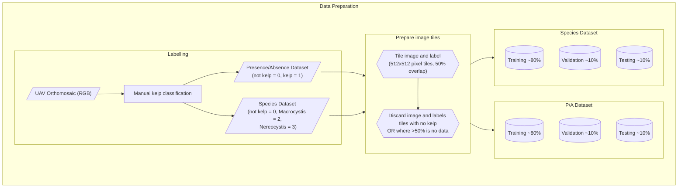

# About

This document gives information about interpreting the Kelp-O-Matic model outputs, and
gives details on the dataset pre-processing workflow, model training, and final
performance achieved for both the kelp and mussel detection models.

## Model Outputs

Each of the Kelp-O-Matic models outputs a mask raster with integer pixel values that
represent the following classes:

### Kelp (RGB and RGBI models)

These are the outputs from the `kom segment kelp-rgb` and `kom segment kelp-rgbi` routines:

| Output value | Class                               |
|-------------:|-------------------------------------|
|        **0** | Background (water, other features)  |
|        **1** | *Macrocystis pyrifera* (Giant kelp) |
|        **2** | *Nereocystis luetkeana* (Bull kelp) |

### Kelp (PS8B model)

These are the outputs from the `kom segment kelp-ps8b` routine:

| Output value | Class                               |
|-------------:|-------------------------------------|
|        **0** | Background (water, other features)  |
|        **1** | Kelp                                |

### Mussels

These are the outputs from the `kom segment mussel-rgb` and `kom segment mussel-gooseneck-rgb` routines:

| Output value | Class                                            |
|-------------:|--------------------------------------------------|
|        **0** | Background (water, rocks, other substrates)      |
|        **1** | Mussels (typically blue mussels, *Mytilus* spp.) |
|        **2** | Gooseneck barnacles (*Pollicipes* spp.)          |

## Dataset Preparation

The datasets used to train the kelp segmentation model were a number of scenes collected
using DJI Phantom remotely-piloted aircraft systems (RPAS). A total of 28 image mosaic
scenes were used. The resolution of each image varied between 0.023m and 0.428m, with
an average of 0.069m and standard deviation of 0.087m. These images were collected over
a period from 2018 to 2021, all during summer.

For model training, each dataset was divided into 512 pixels square cropped sections,
with 50% overlap between adjacent tiles. To balance the dataset, tiles containing no
kelp where discarded. These sets of tiles where then divided into training, validation,
and test splits.

Source code for data preparation is available on GitHub
at [:material-github: hakai-ml-dataprep](https://github.com/tayden/hakai-ml-dataprep).

### Pre-processing overview

### Dataset summaries

**Kelp (presence/absence)**

| Split      | Scenes |  Tiles | Pixels~kelp~ | Pixels~total~ | Area (km^2^) | Res~max~ (m) | Res~min~ (m) | Res~$\mu$~ (m) | Res~$\sigma$~ (m) |
|:-----------|-------:|-------:|-------------:|--------------:|-------------:|-------------:|-------------:|---------------:|------------------:|
| Train      |     20 | 829404 | 216770596954 |    3738528864 |     11680.54 |       0.1040 |       0.0230 |         0.0487 |            0.0253 |
| Validation |      4 |  31610 |   8220459464 |     295310084 |       253.79 |       0.0420 |       0.0230 |         0.0296 |            0.0085 |
| Test       |      6 |  92608 |  24093604354 |     639694012 |       819.45 |       0.0680 |       0.0230 |         0.0385 |            0.0161 |
| *Sum*      |     30 | 953622 | 249084660772 |    4673532960 |    12,753.78 |

**Kelp (species)**

| Split      | Scenes |  Tiles | Pixels~macro~ | Pixels~nereo~ | Pixels~total~ | Area (km^2^) | Res~max~ (m) | Res~min~ (m) | Res~$\mu$~ (m) | Res~$\sigma$~ (m) |
|:-----------|-------:|-------:|--------------:|--------------:|--------------:|-------------:|-------------:|-------------:|---------------:|------------------:|
| Train      |     17 | 336740 |     605462674 |    1158650042 |   88008624978 |      4034.11 |       0.1040 |       0.0230 |         0.0488 |            0.0266 |
| Validation |      4 |  15805 |     127410722 |      20244320 |    4110229732 |       123.91 |       0.0420 |       0.0230 |         0.0296 |            0.0085 |
| Test       |      6 |  46304 |     143277498 |     176569508 |   12046802177 |       409.72 |       0.0680 |       0.0230 |         0.0385 |            0.0161 |
| *Sum*      |     27 | 398849 |     876150894 |    1355463870 |  104165656887 |      4567.75 |              |              |                |                   |

**Mussels (presence/absence)**

| Split      | Scenes | Tiles | Pixels~mussels~ | Pixels~total~ | Area (km^2^) | Res~max~ (m) | Res~min~ (m) | Res~$\mu$~ (m) | Res~$\sigma$~ (m) |
|:-----------|-------:|------:|----------------:|--------------:|-------------:|-------------:|-------------:|---------------:|------------------:|
| Train      |     39 |  4834 |       933287123 |    5068816384 |      23.8147 |        0.027 |      0.00231 |      0.0082244 |        0.00492054 |
| Validation |      8 |  1277 |       223598444 |    1339031552 |      5.74255 |   0.00518591 |   0.00330667 |     0.00421985 |       0.000545617 |
| Test       |      8 |  1110 |       175226412 |    1163919360 |      4.64052 |   0.00578278 |     0.003671 |     0.00435929 |       0.000665025 |
| *Sum*      |     55 |  7221 |      1332111979 |    7571767296 |    34.197799 |     0.037969 |     0.009288 |       0.016804 |          0.006131 |

## Model Training

Source code for model training is available on GitHub
at [:material-github: hakai-ml-train](https://github.com/tayden/hakai-ml-train).

### Training overview

## Model Performance

### Metric definitions

The following definitions describe the metrics used during training and evaluation of
the deep neural networks. They are important to understand for the sections following.

**Definitions in terms of pixel sets:**

- Let $A$ equal the set of human-labelled pixels.
- Let $B$ be defined as the set of pixel labels predicted by the model.
- Let $A_i$ and $B_i$ be the sets of pixels for a particular class of interest, $i$,
  from labels $A$ and $B$, respectively.

**Definitions in terms of true and false postive/negative classes:**

For class $i$:

- Let $TP_i$ be the true positives.
- Let $FP_i$ be the false positives.
- Let $TN_i$ be the true negatives.
- Let $FN_i$ be the false negatives.

**IoU**

:   The "intersection over union", also called the "Jaccard Index". Defined as:

$$
IoU_i (A,B) = \frac{|A_i \cap B_i|}{|A_i \cup B_i|} = \frac{TP_i}{TP_i + FP_i + FN_i}
$$

**Precision**

:   The ratio of correct predictions for a class to the count of predictions of that
class:

$$
Precision_i = \frac{|A_i \cap B_i|}{|A_i|} = \frac{TP_i}{TP_i + FP_i}
$$

**Recall**

:   The ratio of correct predictions for a class to the count of actual instances of
that class:

$$
Recall_i = \frac{|A_i \cap B_i|}{|B_i|} = \frac{TP_i}{TP_i + FN_i}
$$

**F1**

:   The harmonic mean of precision and recall for a class, providing a single metric that balances both:

$$
F1_i = 2 \cdot \frac{Precision_i \cdot Recall_i}{Precision_i + Recall_i} = \frac{2TP_i}{2TP_i + FP_i + FN_i}
$$

### Summary statistics

All statistics are for the latest model revisions on the validation split of our internal training dataset.

=== "**kelp-rgb**"

    Model Architecture: Two UNet++ EfficientNetV2-M, one for kelp presence/absence.
      One model is trained for kelp presence/absence detection, and the other kelp species classification.
      Models are ensembled for final output using learned weights.
    
      | Class      |    IoU | Precision | Recall | F1     |
      |:-----------|-------:|----------:|-------:|-------:|
      | Macro      | 0.8816 |    0.9111 | 0.9645 | 0.9371 |
      | Nereo      | 0.8972 |    0.9484 | 0.9433 | 0.9458 |
      | Background | 0.9916 |    0.9964 | 0.9951 | 0.9958 |

=== "**kelp-rgbi**"

    Model Architecture: Two UNet++ EfficientNetB3 (SCSE decoder attention).
      One model is trained for kelp presence/absence detection, and the other kelp species classification.
      Models are ensembled for final output using learned weights.
    
      | Class      |    IoU | Precision | Recall |     F1 |
      |:-----------|-------:|----------:|-------:|-------:|
      | Macro      | 0.9670 |    0.9787 | 0.9878 | 0.9832 |
      | Nereo      | 0.9328 |    0.9568 | 0.9738 | 0.9652 |
      | Background | 0.9988 |    0.9996 | 0.9992 | 0.9994 |

=== "**kelp-ps8b**"

    Model Architecture: SegFormer mit-b3
    
      | Class |    IoU | Precision | Recall |     F1 |
      |:------|-------:|----------:|-------:|-------:|
      | Kelp  | 0.8901 |    0.9367 | 0.9472 | 0.9419 |

=== "**mussel-rgb**"

    Model Architecture: SegFormer mit-b3
    
      | Class   |    IoU | Precision |   Recall |     F1 |
      |:--------|-------:|----------:|---------:|-------:|
      | Mussels | 0.8869 |    0.9343 |   0.9459 | 0.9401 |

=== "**mussel-gooseneck-rgb**"

    Model Architecture: SegFormer mit-b3
    
      | Class        |    IoU | Precision | Recall |     F1 |
      |:-------------|-------:|----------:|-------:|-------:|
      | Mussels      | 0.8288 |    0.9119 | 0.9010 | 0.9064 |
      | Gooseneck B. | 0.7801 |    0.8652 | 0.8880 | 0.8765 |
      | Background   | 0.9831 |    0.9919 | 0.9911 | 0.9915 |
