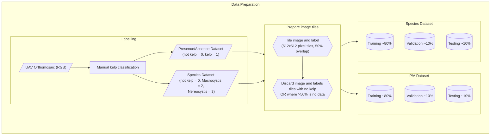

# About

This document gives information about interpreting the Kelp-O-Matic model outputs, and gives
details on the dataset pre-processing workflow, model training, and final performance achieved for
both the kelp and mussel detection models.

## Model Outputs

Each of the Kelp-O-Matic models outputs a mask raster with integer pixel values that represent the
following classes:

### Kelp

These are the outputs from the `find-kelp` routine:

| Output value | Class                        |
|-------------:|------------------------------|
|        **0** | Background                   |
|        **1** | Kelp *(presence mode)*       |
|        **2** | Macrocystis *(species mode)* |
|        **3** | Nereocystis *(species mode)* |

### Mussels

These are the outputs from the `find-mussels` routine:

| Output value | Class      |
|-------------:|------------|
|        **0** | Background |
|        **1** | Mussles    |

## Dataset Preparation

The datasets used to train the kelp segmentation model were a number of scenes collected using DJI
Phantom remotely-piloted aircraft systems (RPAS). A total of 28 image mosaic scenes were used. The
resolution of each image varied between 0.023m and 0.428m, with an average of 0.069m and standard
deviation of 0.087m. These images were collected over a period from 2018 to 2021, all during summer.

For model training, each dataset was divided into 512 pixels square cropped sections, with 50%
overlap between adjacent tiles. To balance the dataset, tiles containing no kelp where discarded.
These sets of tiles where then divided into training, validation, and test splits.

Source code for data preparation is available on GitHub
at [:material-github: hakai-ml-dataprep](https://github.com/tayden/hakai-ml-dataprep).

### Pre-processing overview

### Dataset summaries

**Kelp (presence/absence)**

| Split      | Scenes |  Tiles | Pixels~kelp~ | Pixels~total~ | Area (km^2^) | Res~max~ (m) | Res~min~ (m) | Res~$\mu$~ (m) | Res~$\sigma$~ (m) |
|:-----------|-------:|-------:|-------------:|--------------:|-------------:|-------------:|-------------:|---------------:|------------------:|
| Train      |     20 | 829404 | 216770596954 |    3738528864 |     11680.54 |       0.1040 |       0.0230 |         0.0487 |            0.0253 |
| Validation |      4 |  31610 |   8220459464 |     295310084 |       253.79 |       0.0420 |       0.0230 |         0.0296 |            0.0085 |
| Test       |      6 |  92608 |  24093604354 |     639694012 |       819.45 |       0.0680 |       0.0230 |         0.0385 |            0.0161 |
| *Sum*      |     30 | 953622 | 249084660772 |    4673532960 |    12,753.78 |

**Kelp (species)**

| Split | Scenes |  Tiles | Pixels~macro~ | Pixels~nereo~ | Pixels~total~ | Area (km^2^) | Res~max~ (m) | Res~min~ (m) | Res~$\mu$~ (m) | Res~$\sigma$~ (m) |
|:------|-------:|-------:|--------------:|--------------:|--------------:|-------------:|-------------:|-------------:|---------------:|------------------:|
| Train |     17 | 336740 |     605462674 |    1158650042 |   88008624978 |      4034.11 |       0.1040 |       0.0230 |         0.0488 |            0.0266 |
| Val.  |      4 |  15805 |     127410722 |      20244320 |    4110229732 |       123.91 |       0.0420 |       0.0230 |         0.0296 |            0.0085 |
| Test  |      6 |  46304 |     143277498 |     176569508 |   12046802177 |       409.72 |       0.0680 |       0.0230 |         0.0385 |            0.0161 |
| *Sum* |     27 | 398849 |     876150894 |    1355463870 |  104165656887 |      4567.75 |              |              |                |                   |

**Mussels (presence/absence)**

!!! todo

    The mussel model is a work in progress. This section will be available in the future.

## Model Training

The LRASPP MobileNetV3-Large[^1] model was trained using a stochastic gradient descent optimizer
with the learning rate set to $0.35$, and L2 weight decay set to $3 \times 10^{-6}$. The model was
trained for a total of 100 epochs. A cosine annealing learning rate schedule[^2] was used to improve
accuracy. The loss function used for training was Focal Tversky Loss[^3], with parameters
$\alpha=0.7, \beta=0.3, \gamma=4.0 / 3.0$.

The model was trained on an AWS p3.8xlarge instance with 4 Nvidia Tesla V100 GPUS and took 18
hours to finish. At the end of training, the model parameters which achieved the best
IoU~$\mu$~ score on the validation data split were saved for inference. It is these parameters that
were used to calculate the final performance statistics for the model on the test split.

Source code for model training is available on GitHub
at [:material-github: hakai-ml-train](https://github.com/tayden/hakai-ml-train).

[^1]: [A. Howard et al., ‘Searching for MobileNetV3’. arXiv, 2019.](https://arxiv.org/abs/1905.02244)
[^2]: [I. Loshchilov and F. Hutter, ‘SGDR: Stochastic Gradient Descent with Warm Restarts’. arXiv, 2016.](https://arxiv.org/abs/1608.03983)
[^3]: [N. Abraham and N. M. Khan, ‘A Novel Focal Tversky loss function with improved Attention U-Net for lesion segmentation’. arXiv, 2018.](https://arxiv.org/abs/1810.07842)

### Training overview

## Model Performance

### Metric definitions

The following definitions describe the metrics used during training and evaluation of the deep
neural networks. They are important to understand for the sections following.

**Definitions in terms of pixel sets:**

- Let $A$ equal the set of human-labelled pixels.
- Let $B$ be defined as the set of pixel labels predicted by the model.
- Let $A_i$ and $B_i$ be the sets of pixels for a particular class of interest, $i$, from labels $A$
  and $B$, respectively.

**Definitions in terms of true and false postive/negative classes:**

For class $i$:

- Let $TP_i$ be the true positives.
- Let $FP_i$ be the false positives.
- Let $TN_i$ be the true negatives.
- Let $FN_i$ be the false negatives.

**IoU**

:   The "intersection over union", also called the "Jaccard Index". Defined as:

$$
IoU_i (A,B) = \frac{|A_i \cap B_i|}{|A_i \cup B_i|} = \frac{TP_i}{TP_i + FP_i + FN_i}
$$

**Precision**

:   The ratio of correct predictions for a class to the count of predictions of that class:

$$
Precision_i = \frac{|A_i \cap B_i|}{|A_i|} = \frac{TP_i}{TP_i + FP_i}
$$

**Recall**

:   The ratio of correct predictions for a class to the count of actual instances of that class:

$$
Recall_i = \frac{|A_i \cap B_i|}{|B_i|} = \frac{TP_i}{TP_i + FN_i}
$$

**Accuracy**

:   The ratio of counts of pixels correctly classified by the model divided over the total number of
pixels.

$$
Accuracy = \frac{TP + TN}{TP + TN + FP + FN}
$$

### Summary statistics

**Kelp (presence/absence)**

=== "Test split"

    | Class    |    IoU | Precision | Recall | Accuracy |
    |:---------|-------:|----------:|-------:|---------:|
    | Kelp     | 0.6593 |    0.8145 | 0.7804 |          |
    | Not Kelp | 0.9885 |    0.9939 | 0.9945 |          |
    | *Mean*   | 0.8239 |    0.9042 | 0.8875 |   0.9892 |

=== "Validation split"

    | Class    |    IoU | Precision | Recall | Accuracy |
    |:---------|-------:|----------:|-------:|---------:|
    | Kelp     | 0.6964 |    0.7585 | 0.8917 |          |
    | Not Kelp | 0.9857 |    0.9969 | 0.9886 |          |
    | *Mean*   | 0.8410 |    0.8777 | 0.9402 |   0.9865 |

=== "Train split"

    | Class    |    IoU | Precision | Recall | Accuracy |
    |:---------|-------:|----------:|-------:|---------:|
    | Kelp     | 0.7786 |    0.8510 | 0.8980 |          |
    | Not Kelp | 0.9716 |    0.9889 | 0.9822 |          |
    | *Mean*   | 0.8751 |    0.9200 | 0.9401 |   0.9757 |

**Kelp (species)**

=== "Test split"

    | Class    |    IoU | Precision | Recall | Accuracy |
    |:---------|-------:|----------:|-------:|---------:|
    | Macro    | 0.7574 |    0.8558 | 0.8697 |          |
    | Nereo    | 0.5336 |    0.7279 | 0.6716 |          |
    | Not Kelp | 0.9885 |    0.9939 | 0.9945 |          |
    | *Mean*   | 0.7645 |    0.8657 | 0.8410 |   0.9881 |

=== "Validation split"

    | Class    |    IoU | Precision | Recall | Accuracy |
    |:---------|-------:|----------:|-------:|---------:|
    | Macro    | 0.7392 |    0.7942 | 0.9126 |          |
    | Nereo    | 0.4369 |    0.5128 | 0.7696 |          |
    | Not Kelp | 0.9423 |    0.9848 | 0.9562 |          |
    | *Mean*   | 0.7810 |    0.8367 | 0.9055 |   0.9522 |

=== "Train split"

    | Class    |    IoU | Precision | Recall | Accuracy |
    |:---------|-------:|----------:|-------:|---------:|
    | Macro    | 0.8133 |    0.8845 | 0.9075 |          |
    | Nereo    | 0.5722 |    0.6741 | 0.7141 |          |
    | Not Kelp | 0.9579 |    0.9828 | 0.9742 |          |
    | *Mean*   | 0.8118 |    0.8719 | 0.8855 |   0.9649 |

**Mussels (presence/absence)**

!!! todo

    The mussel model is a work in progress. This section will be updated in the future.

=== "Validation split"

    | Class       |    IoU | Precision | Recall | Accuracy |
    |:------------|-------:|----------:|-------:|---------:|
    | Mussels     | 0.7188 |         - |      - |          |
    | Not Mussels | 0.9622 |         - |      - |          |
    | *Mean*      | 0.8405 |         - |      - |   0.9678 |
