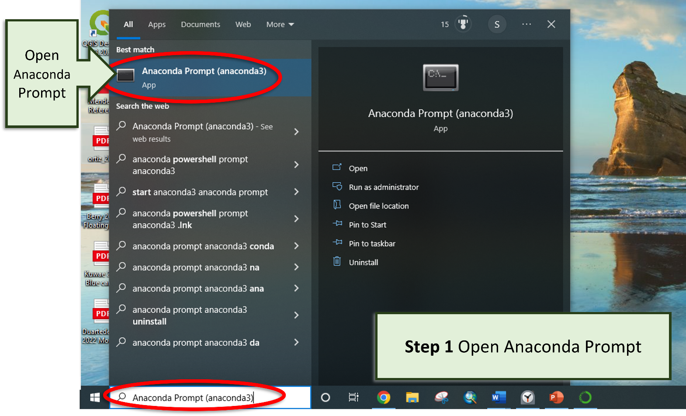
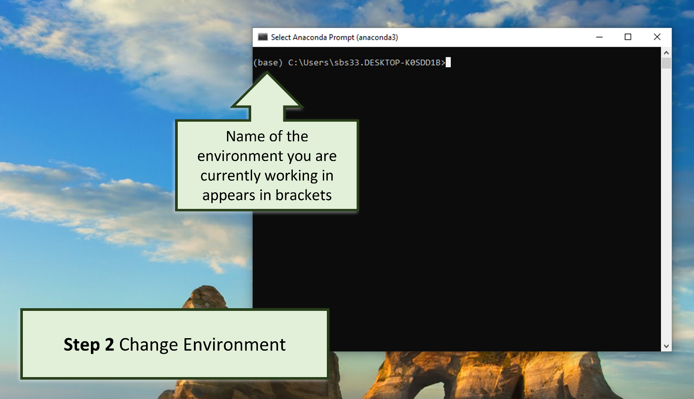
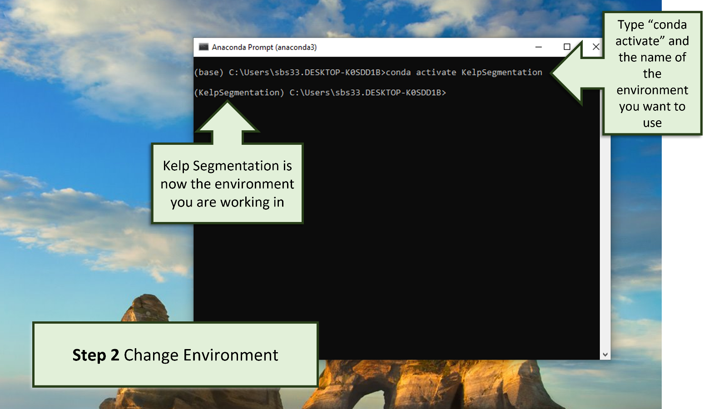
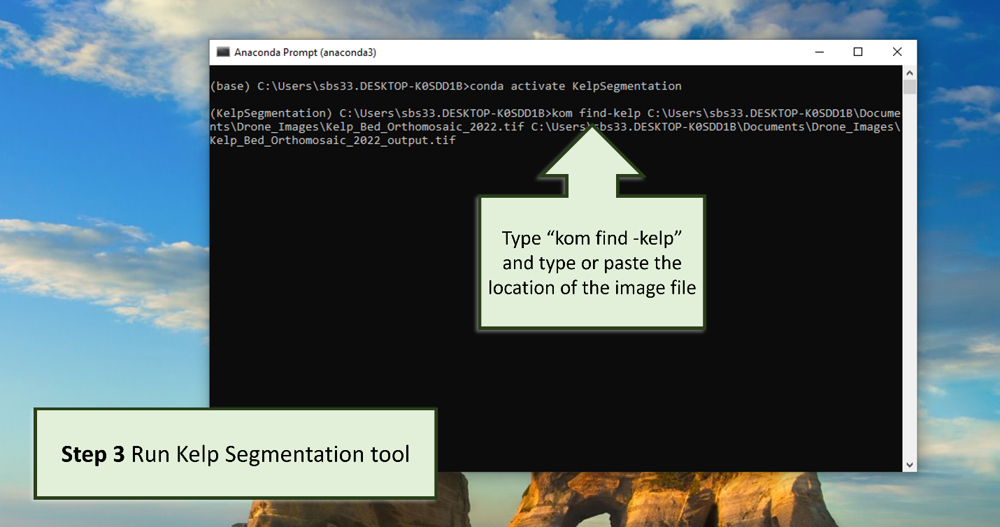
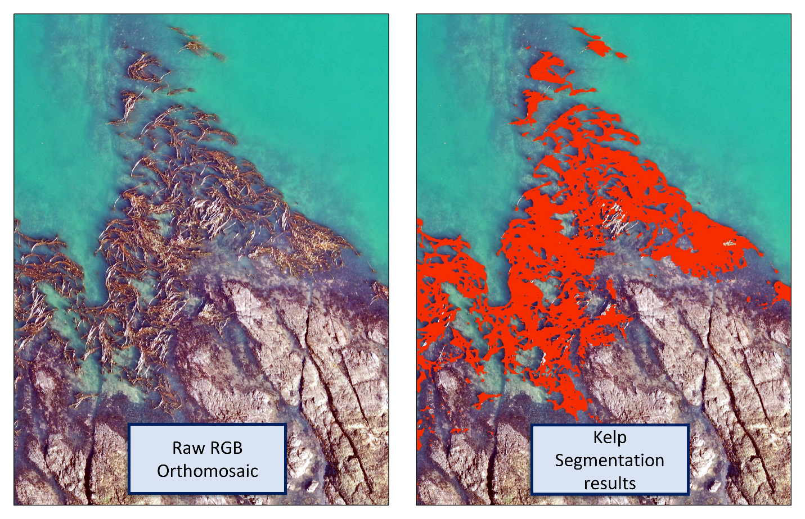

# Running the Segmentation Tool

Each time you want to run a classification on new imagery follow these steps.

***

## Open Anaconda Prompt



Open anaconda prompt by searching “Anaconda Prompt” in search tool bar.

***

## Change Environments



The default environment is called `(base)` which will appear in brackets before each
line of text.



To change to the new environment that you created in Part 1,
type: `conda activate KelpSegmentation` and press enter.
In this command, "KelpSegmentation" was the name that you chose for your new
environment.
Now you will see that the environment has changed from `(base)` to `(KelpSegmentation)`
as KelpSegmentation is now appearing in brackets.

!!! note

    If you used a different name for your environment, be sure to replace 
    `conda activate KelpSegmentation` with `conda activate <your-environment-name-here>`

    You can see a list of all installed environments by typing and entering the 
    command: `conda env list`.

***

## Run Segmentation Tool



Type `kom find-kelp` and copy and paste the location of the image in which you would
like to detect kelp. Add a space
and then type or paste the location you would like the output file to be saved on your
computer with the name of the
output file.

In this example the orthomosaic to be classified is named
“Kelp_Bed_Orthomosaic_2022.tif” and its location is in the C
drive, documents folder, Drone_Images subfolder.

`C:\Users\sbs33.DESKTOP-K0SDD1B\Documents\Drone_Images\Kelp_Bed_Orthomosaic_2022.tif`

The output results will be sent to the same Drone_Images folder and will have the name
“Kelp_Bed_Orthomosiac_2022_output.tif”,
where .tif is the file type.

`C:\Users\sbs33.DESKTOP-K0SDD1B\Documents\Drone_Images\Kelp_Bed_Orthomosaic_2022_output.tif`

So, the entire command in the Anaconda prompt is:

```console
kom find-kelp C:\Users\sbs33.DESKTOP-K0SDD1B\Documents\Drone_Images\Kelp_Bed_Orthomosaic_2022.tif C:\Users\sbs33.DESKTOP-K0SDD1B\Documents\Drone_Images\Kelp_Bed_Orthomosaic_2022_output.tif
```

Press ++enter++ and wait for the segmentation to run; the time may vary depending on the
size of the image.

!!! note

    You can always get help documentation for the `kom find-kelp` tool by typing into 
    the prompt `kom find-kelp --help`.

    This help documentation is the same as what is shown under 
    the :doc:`Command Line Reference <./cli>`.

!!! tip

    If you manually type in the path to your file, use the `<tab>` key to have your 
    operating system autocomplete the paths for you.

    *e.g.*, if you type `kom find-kelp C:\\Desk`, then press the `<tab>` key, your 
    operating system should complete the command for you so it 
    reads: `kom find-kelp C:\\Desktop`.

    If the partial path is ambiguous, tapping `<tab>` multiple times will cycle through 
    the possible path options.

    You can continue doing this as you type in the location to autocomplete the text 
    for long path names. It is faster, and less error prone than typing the whole 
    path yourself.



Once the processing bar is at 100%, you can open the results in an image processing or
spatial analysis software such as QGIS or ArcGIS. Review the results for errors and edit
as needed.

**Part 2 Kelp Segmentation is now complete!**

Continue to [Part 3](./post_processing.md) to learn how to post-process the results.
***

*Authors: Sarah Schroeder and Taylor Denouden*
