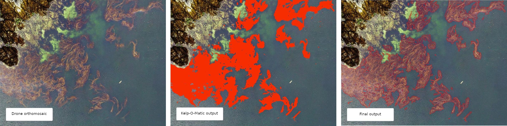
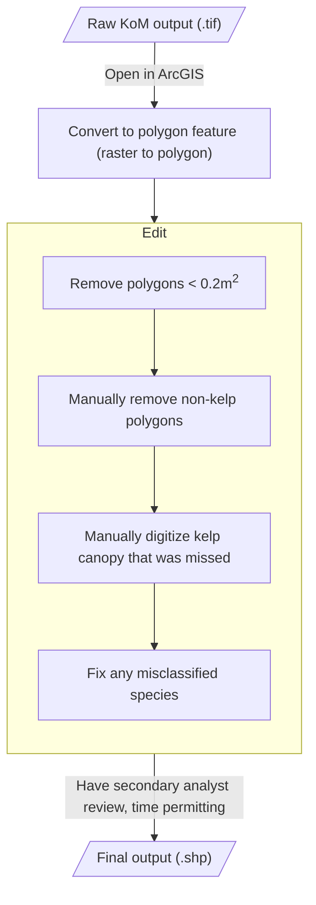
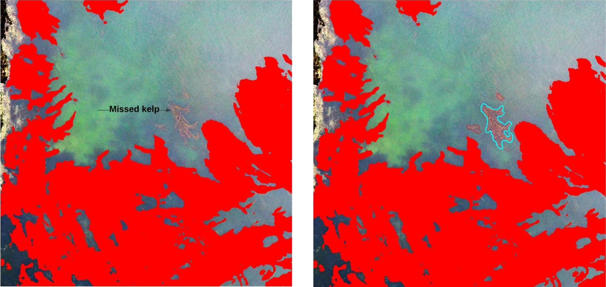

# Methods for Post-Processing Kelp-O-Matic Output[^1]

This document describes the methods used for generating analysis ready data on species-level kelp
extent from outputs from the Kelp-O-Matic tool. Final outputs consist of polygon features (.shp)
that contain species-level classification of emergent canopy kelp present in drone imagery.

These instructions assume a basic level of experience with the ArcMAP GIS interface. For questions,
please contact [Luba Reshitnyk](email:luba.reshitnyk@hakai.org) at
the [Hakai Institute](https://hakai.org).

[^1]: Created by Luba Reshitnyk, February 2023

## Workflow Overview

[//]: # (See: https://mermaid.js.org/syntax/flowchart.html for help)

## Detailed Workflow

This section assumes that you have obtained output from the Kelp-O-Matic (.tif) and have a new
instance of ArcMap (version 10.8). These same steps can be done using other GIS software (e.g. QGIS)

??? tip "Tip: ArcMap Keyboard Shortcuts"

    Keyboard shortcuts can make the editing process much faster. To enable some, go to `Customize > Customize Mode > Keyboard…`.
    
    Some useful shortcuts include:
        
    1. Edit tool (set to ++ctrl+e++)
        1. This lets you toggle to the editor tool.
    2. Delete (set to ++ctrl+d++)
        1. Delete selected polygon features.
    3. Freehand tool (set to ++ctrl+r++)
        1. Toggle to freehand tool to manually digitize kelp feature polygons.
    4. Clip (set to ++ctrl+w++)
        1. Quickly draw a polygon then click ctrl+W to delete the polygon features within the newly drawn polygon. Then delete that polygon.

### Load Kelp-O-Matic Raster

Load the output `.tif` file from Kelp-O-Matic into ArcMap. The raster will have the following
attributes:

| Output value (gridcode)| Class                        |
|-------------:|------------------------------|
|        **0** | Background                   |
|        **1** | Kelp *(presence mode)*       |
|        **2** | Macrocystis *(species mode)* |
|        **3** | Nereocystis *(species mode)* |

### Convert to Polygons

Convert this raster into polygons using the `Raster to Polygon` tool in ArcMap.

1. Uncheck "simplify polygons"
2. Leave the other defaults as they are

### Add New Attributes to Polygons

1. Add a new "area" field
    1. Right click layer in the table of contents
    2. Select `Open attribute table > Table options > Add field`
        1. Name = "area"
        2. Type = "float"
        3. Click `OK`
2. Calculate the area for each polygon
    1. Right click the "area" header in the attribute table, select `Calculate Geometry...`
        1. Property = "area"
        2. Units = "square meters"
        3. Coordinate system = choose an appropriate projection that preserves area (e.g. NAD83 BC Albers Equal Area EPSG = 3005)
        4. Click "OK"  
3. Add a new "species" field
    1. Right click layer in the table of contents
    2. Select `Open attribute table > Table options > Add field`
        1. Name = "species"
        2. Type = "text"
        3. Click `OK`

### Editing and Data Cleaning

#### Delete small polygons that are unlikely to be kelp

1. Start editing this feature polygon layer
2. In the Editor toolbar click `Editor > start editing`. Select the feature layer you will be editing
2. Right click layer in the table of contents, Select `Open attribute table`.
   Click `Select by attribute`
3. Select features < 0.2 m2 by typing: `"area" < 0.2`
4. Right click highlighted features in attribute table and click `Delete Selected`
5. Save edits

#### Manually delete non-kelp polygons

There may be areas where KoM classifier falsely detected kelp and these polygons need to be removed manually. 
     
1. Select using the edit tool or “Select by Lasso” tool
2. Delete the selected polygon(s)
3. Save edits.

#### Add kelp not detected by KoM

If there are locations where emergent canopy kelp was missed by the KoM classifier (example in
figure below) manually digitize these features using the Freehand Tool. You will need to manually
classify these new regions to species (change value in the attribute table). A 1:100 scale is
recommended.

### Review Species Attributes

There may be some areas where the KoM classifier misclassified the species in a given area. These polygons can be edited manually. If you're just interested in presence/absence don't worry about this step.

1. Select all polygon features classified as giant kelp by opening the attribute table and “select by attribute”. Select features representing giant kelp by typing: `"gridcode" = 2`. At the bottom of the attribute table click on the "Show selected records" tab.
2. Right click the "species" field you created earlier. Select "Field Calculator".
3. In the text box enter "Macrocystis pyrifera" (with quotes included) and click OK. This will fill out that attribute for all the selected polygons.

Repeat steps 1 - 3 for bull kelp by using `"gridcode" = 3` and "Nereocystis luetkeana". 

4. Review all the polygon species classification and manually change ones that the KoM classifier misclassified by changing the text in the "species" field for that polygon feature.
5. Save edits.
6. Delete the "gridcode" attribute once you are done.
7. Save edits. 

### Export Data

That's it! You can now export your data a shapefile and give it an appropriate name.