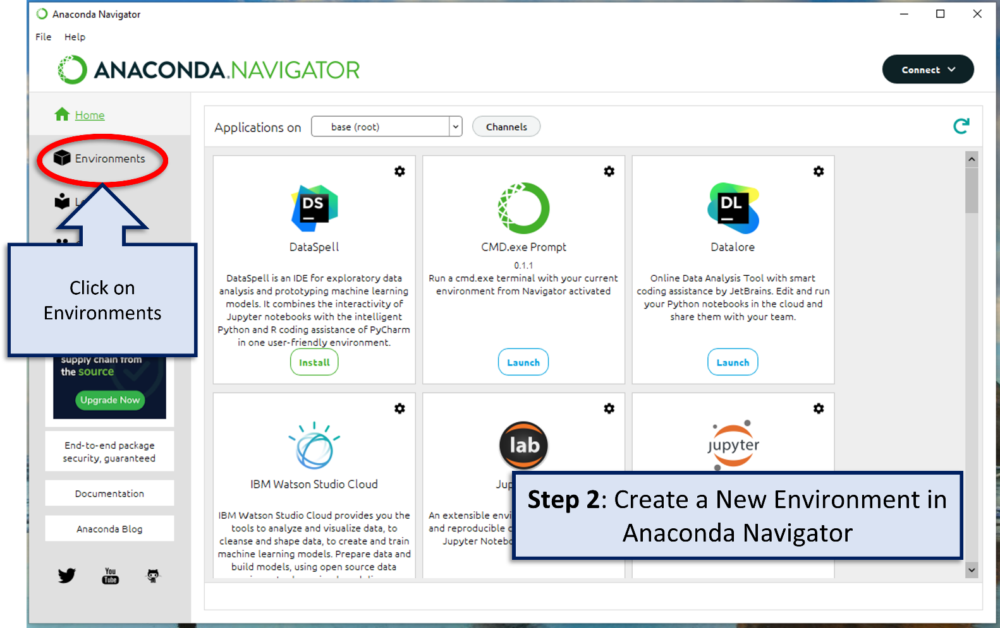
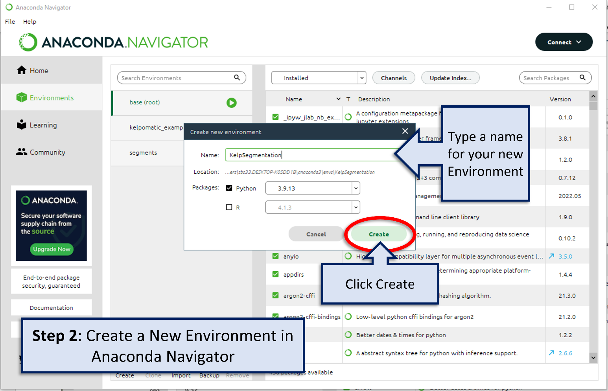
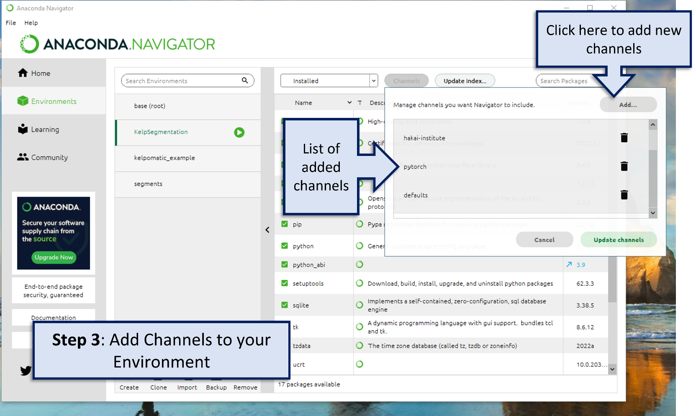
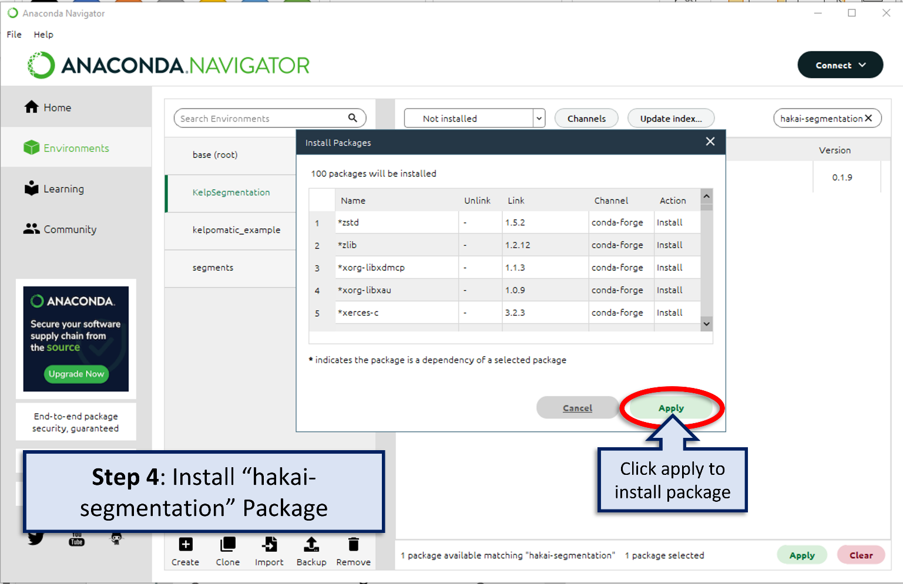

# Set-up and Installation

Before you can run the kelp-o-matic tool, you will need to set up some programs which will allow the tool to run. Once
set-up is complete the tool can be run very easily from ones terminal.

## Install Anaconda

If not already installed, download Anaconda on your computer from the [Anaconda download website](https://www.anaconda.com/products/distribution).
Follow the prompts to install the most recent version of Anaconda for your operating system.

***

## Create New Environment

Once Anaconda is installed, open Anaconda Navigator by typing “Anaconda Navigator” in the start menu.

In the tab on the left, click on Environments.

Create a new environment and give it a name by clicking the create button.

Give the new environment a name in the dialogue box that pops up, *e.g.* "KelpSegmentation".
Select a Python version that begins with "3.9".

!!! warning 
    `kelp-o-matic` currently supports Python versions 3.7, 3.8, 3.9, and 3.10. 
    Installation will not work for other versions.

***

## Add Channels

With the new environment selected in the environment tab, click the channels button.

In the dialogue box that pops up click the “Add…” button.

Add the channels "conda-forge" and "pytorch" by typing the name of each channel in the space and then click update channels.

!!! note
    The "hakai-institute" channel, shown in the image, is no longer required. However, it won't cause any issues if you've added it already.

!!! warning
    Watch your spelling! Anaconda won't be able to find the packages you need to install if the channel names are misspelled.

Click "update channels".

***

## Install Packages

Next you will install the `kelp-o-matic` package in your environment.

In the Anaconda Navigator with your environment selected and “Not Installed” selected in the drop down menu, type “kelp-o-matic” in the search packages search bar.

Type `kelp-o-matic` in the search packages search bar. This is the name of the package you are installing (make sure it is spelled correctly).

Click the box beside `kelp-o-matic` and then click Apply to install the package.

A dialogue box will appear and ask you to install packages, click the apply button.

Now when you select Installed on the drop-down menu the `kelp-o-matic` package should appear.

**Part 1 set-up is now complete!**

You are now ready to run the Kelp-O-Matic tool. Now that the setup steps are completed, you will not 
have to repeat them again unless installing on a different computer.

***

*Authors: Sarah Schroeder and Taylor Denouden*