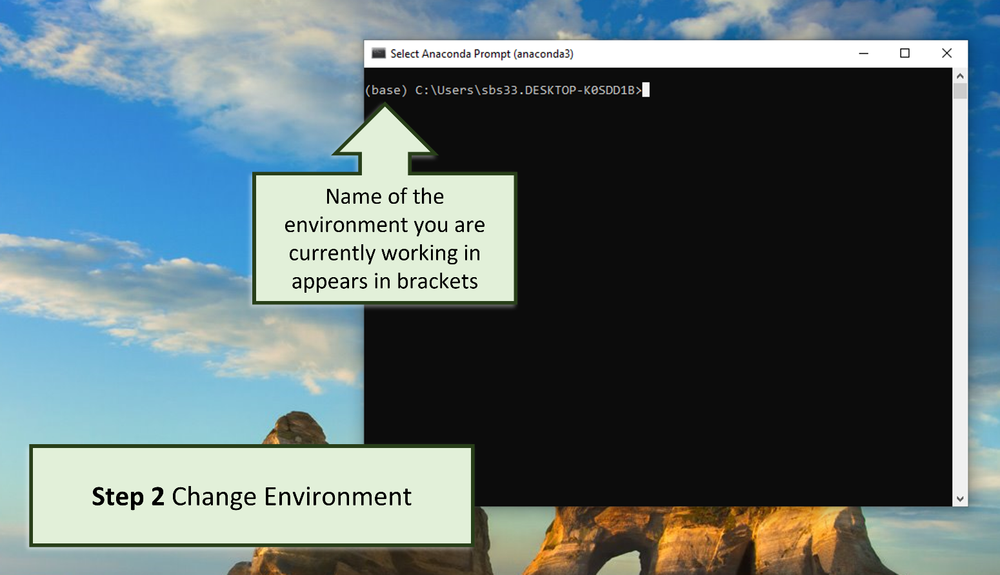

# Set-up and Installation

Before you can run the Kelp-O-Matic tool, you will need to set up some programs which
will allow the tool to run. Once
set-up is complete the tool can be run very easily from ones terminal.

## Install Anaconda

If not already installed, download Anaconda on your computer from
the [Anaconda download website](https://www.anaconda.com/products/distribution).
Follow the prompts to install the most recent version of Anaconda for your operating
system.


***

## Open Anaconda Prompt


Open anaconda prompt by searching “Anaconda Prompt” in search tool bar.

***

## Create New Environment

In the prompt window, create a new Anaconda environment by typing the following command:

```console
conda create -n KelpSegmentation python=3.10
```

This will create an isolated Python environment for packages and their dependencies to
be installed in. The name of the
environment is `KelpSegmentation` in this example, but you can choose any name you like.
This command also installs Python version 3.10 into your new environment.

??? question "Why do we use a new environment?"

    Using a new Conda environment is a good practice to get into when installing Python
    packages. It ensures that the software you install does not conflict with other
    software on your computer, as well as makes it easy to remove when you don't want
    it anymore.

## Change Environments

Now, we're going to activate the environment we just created. By default, the Anaconda
Prompt always starts in the `(base)` environment.
You can tell this is the case, because `(base)` will appear in brackets before each line
of text.



Let's change into the environment we just created. To do this, type into the prompt:

```console
conda activate KelpSegmentation
```

!!! note

    If you used a different name for your environment, be sure to replace
    `conda activate KelpSegmentation` with `conda activate <your-environment-name-here>`

    You can see a list of all installed environments by typing and entering the
    command: `conda env list`.


You should see that the environment has changed from `(base)` to `(KelpSegmentation)` in
the prompt.

***

## Install packages

Now that we're in the new environment, we can install the packages that the Kelp-O-Matic
tool needs to run, followed by Kelp-O-Matic itself.

At this stage, you can directly reference
the [installation instructions](../installation.md) if you find that easier, or continue
with the following instructions.

### Install PyTorch

Kelp-O-Matic relies on PyTorch to run. PyTorch is a machine learning library for Python.
PyTorch can be installed to use your CPU only, or can make use of an NVIDIA GPUs you may
have in your machine to accelerate processing.

The most up-to-date and reliable instructions for installing PyTorch can be found on
the [PyTorch website](https://pytorch.org).
Typically, the installation commands are:

##### GPU

```console
conda install pytorch torchvision pytorch-cuda=11.8 -c pytorch -c nvidia
```

##### CPU

```console
conda install pytorch torchvision cpuonly -c pytorch
```

### Install Kelp-O-Matic

Now that PyTorch is installed, we can install Kelp-O-Matic itself. To do so, run the
command:

```console
conda install -c conda-forge kelp-o-matic
```

**Part 1 set-up is now complete!**

You are now ready to run the Kelp-O-Matic tool. Now that the setup steps are completed,
you will not
have to repeat them again unless installing on a different computer.

Continue to [Part 2: Running the Segmentation tool](./execution.md)

***

*Authors: Sarah Schroeder and Taylor Denouden*
