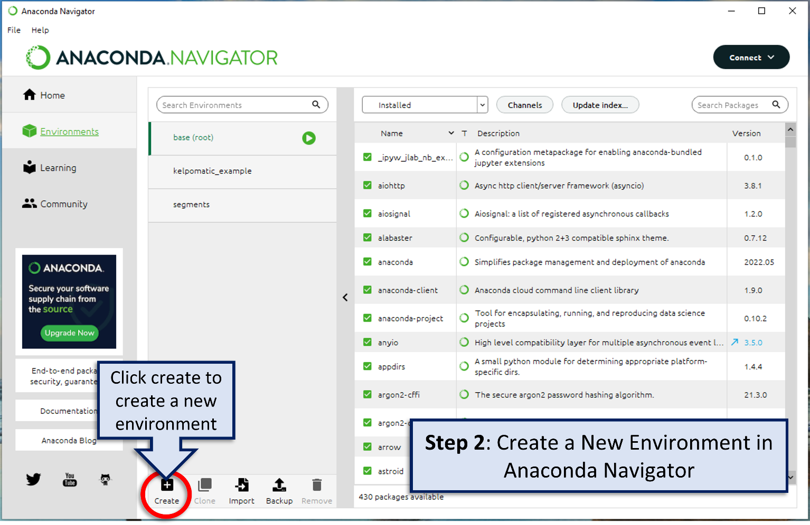
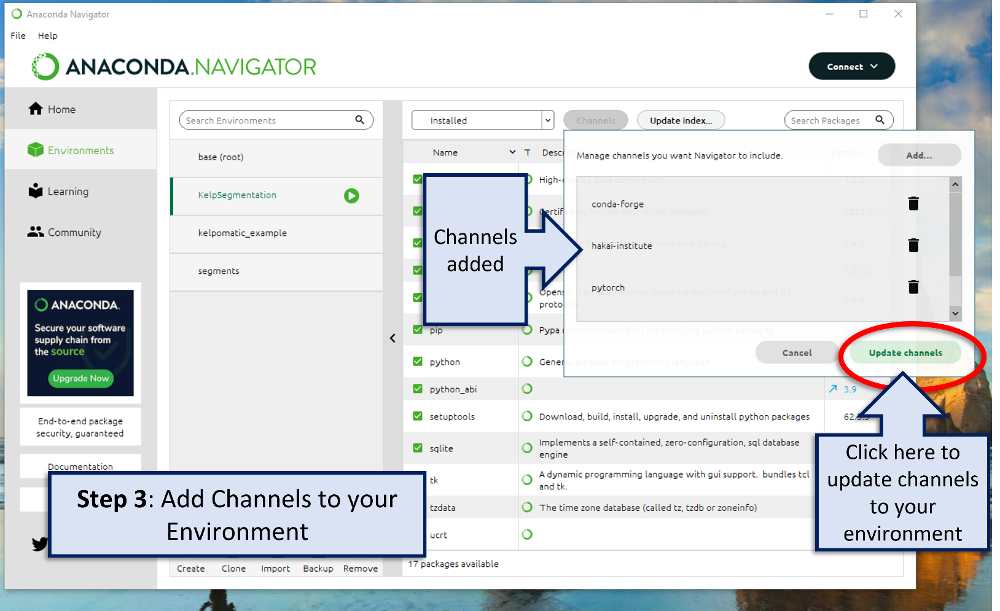

Set-up and Installation
=======================

Before you can run the kelp-o-matic tool, you will need to set up some programs which will allow the tool to run. Once
set-up is complete the tool can be run very easily from ones terminal.

Install Anaconda
----------------

If not already installed, download Anaconda on your computer from the |anaconda_downloads_page|.
Follow the prompts to install the most recent version of Anaconda for your operating system.

..  image:: ./images/install_anaconda.png
    :width: 100%

..  |anaconda_downloads_page| raw:: html

    <a href="https://www.anaconda.com/products/distribution" target="_blank">Anaconda download website</a>

----

Create New Environment
----------------------

Once Anaconda is installed, open Anaconda Navigator by typing “Anaconda Navigator” in the start menu.

..  image:: ./images/create_environment1.png
    :width: 100%

In the tab on the left, click on Environments.

Create a new environment and give it a name by clicking the create button.

..  image:: ./images/create_environment3.png
    :width: 100%

Give the new environment a name in the dialogue box that pops up, *e.g.* “KelpSegmentation”.
Select a Python version that begins with "3.9".

..  warning:: ``kelp-o-matic`` currently supports Python versions 3.7, 3.8, and 3.9 only. Installation will not work for other versions.

----

Add Channels
------------

..  image:: ./images/add_channels1.png
    :width: 100%

With the new environment selected in the environment tab, click the channels button.

..  image:: ./images/add_channels2.png
    :width: 100%

In the dialogue box that pops up click the “Add…” button.

..  image:: ./images/add_channels3.png
    :width: 100%

Add the channels “hakai-institute”, “conda-forge” and “pytorch” by typing the name of each channel in the space and then click update channels.

..  warning:: Watch your spelling! Anaconda won't be able to find the packages you need to install if the channel names are misspelled.

Click “update channels”.

----

Install Packages
----------------

Next you will install the “kelp-o-matic” package in your environment.

In the Anaconda Navigator with your environment selected and “Not Installed” selected in the drop down menu, type “kelp-o-matic” in the search packages search bar.

..  image:: ./images/install_packages2.png
    :width: 100%

Type “kelp-o-matic” in the search packages search bar. This is the name of the package you are installing (make sure it is spelled correctly).

..  image:: ./images/install_packages3.png
    :width: 100%

Click the box beside “kelp-o-matic” and then click Apply to install the package.

..  image:: ./images/install_packages4.png
    :width: 100%

A dialogue box will appear and ask you to install packages, click the apply button.

..  image:: ./images/install_packages5.png
    :width: 100%

Now when you select Installed on the drop-down menu the “kelp-o-matic” package should appear.

**Part 1 set-up is now complete!**

You are now ready to run the Hakai-Segmention tool. Once completed, the set-up steps will not have to be repeated on your computer.

----

*Authors: Sarah Schroeder and Taylor Denouden*