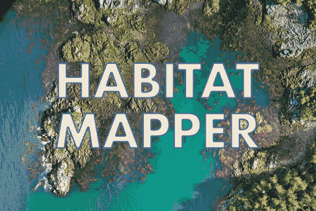

# Habitat-Mapper {: style="display: none;" }

<div align="center" markdown="1">

<a href="https://github.com/HakaiInstitute/habitat-mapper/actions/workflows/test.yml">
    
</a>
<a href="https://pypi.org/project/habitat-mapper">
    
</a>
<a href="https://github.com/HakaiInstitute/habitat-mapper/blob/main/LICENSE">
    
</a>
<a href="https://zenodo.org/badge/latestdoi/462897183">
    
</a>

{ width=600 }

## **Habitat Segmentation with AI**

*(The artist formerly known as "Kelp-O-Matic")*

[Get Started :material-arrow-right:](beginner_guide/index.md){ .md-button .md-button--primary }
[View on GitHub :material-github:](https://github.com/HakaiInstitute/habitat-mapper){ .md-button }

</div>

---

## What is Habitat-Mapper?

Habitat-Mapper is an open-source tool for segmenting geospatial imagery. It automates the detection of coastal species
using deep learning, streamlining analysis for drone (RPAS), aerial, and satellite imagery.

<div class="grid cards" markdown>

-   :material-leaf: **Kelp Detection**

    ---
    Detects *Macrocystis* and *Nereocystis* canopies in RGB and RGB+NIR aerial/drone imagery.

-   :material-waves: **Intertidal Life**

    ---
    Identifies Mussels and Gooseneck Barnacles in high-resolution RGB drone imagery.

-   :material-satellite-variant: **Satellite Scale**

    ---
    Analyzes 8-band PlanetLabs satellite imagery for broad-scale kelp presence/absence.

</div>

## Quick Start

Install and run your first segmentation in three steps.

1. Install via `pip`
    ```bash
    pip install habitat-mapper
    ```

2. Check available models
```bash
hab models
```
```bash
┏━━━━━━━━━━━━━━━━━━━━━━┳━━━━━━━━━━┳━━━━━━━━━━━━━━━━━━━━━━━━━━━━━━━━━━━━━━━━━━━━━━━━━━━━━━━━━━━━━━━━━━━━━━━━━┳━━━━━━━━━━━┓
┃ Model Name           ┃ Revision ┃ Description                                                             ┃ Status    ┃
┡━━━━━━━━━━━━━━━━━━━━━━╇━━━━━━━━━━╇━━━━━━━━━━━━━━━━━━━━━━━━━━━━━━━━━━━━━━━━━━━━━━━━━━━━━━━━━━━━━━━━━━━━━━━━━╇━━━━━━━━━━━┩
│ kelp-ps8b            │ 20250818 │ Kelp segmentation model for 8-band PlanetScope imagery.                 │ Cached    │
│ kelp-rgb             │ 20240722 │ Kelp segmentation model for RGB drone imagery.                          │ Cached    │
│ kelp-rgbi            │ 20231214 │ Kelp segmentation model for 4-band RGB+NIR drone imagery.               │ Cached    │
│ mussel-gooseneck-rgb │ 20250725 │ Mussel and gooseneck barnacle segmentation model for RGB drone imagery. │ Available │
│ mussel-rgb           │ 20250711 │ Mussel segmentation model for RGB drone imagery.                        │ Available │
└──────────────────────┴──────────┴─────────────────────────────────────────────────────────────────────────┴───────────┘
```

3. Segment an image
```bash
hab segment kelp-rgb input_image.tif output_mask.tif
```

!!! tip "New to the Command Line?"
    Don't worry! We have a dedicated **[Beginner's Guide](/beginner_guide)**
    that walks you through setting up your terminal, installing the software, and processing your first image.

---

## Choose Your Path

=== "New to Command Line Tools"

    Never used a terminal before? Start here:

    1. [Terminal Crash Course](beginner_guide/terminal_crash_course.md) - Learn basic terminal navigation
    2. [Installation Guide](installation.md) - Set up the software step-by-step
    3. [Your First Segmentation](beginner_guide/execution.md) - Process your first image
    4. [Post-Processing Results](beginner_guide/post_processing.md) - Clean and analyze your data

=== "Experienced Python Users"

    Jump straight to what you need:

    - [Installation](installation.md) - Quick `pip install habitat-mapper`
    - [CLI Reference](cli.md) - All command options
    - [Python API](python_lib.md) - Use as a library in your scripts
    - [Input Requirements](expectations.md) - Data format specifications

---

## Project & Community

### Contribute

We welcome feedback\! If you encounter bugs or have feature requests, please use
our [Issue Tracker](https://github.com/HakaiInstitute/habitat-mapper/issues).

### Team

This project was co-created at the [Hakai Institute](https://hakai.org) by:

| Name                | Role                                          |
|:--------------------|:----------------------------------------------|
| **Taylor Denouden** | Machine Learning & Software Development       |
| **Luba Reshitnyk**  | Scientific Application (Kelp), Data Collation |
| **Will McInnes**    | Data Collation & Labelling (Mussels)          |
| **Alyssa Gehman**   | Scientific Application (Mussels)              |

### License

Habitat-Mapper is released under
the [MIT license](https://raw.githubusercontent.com/tayden/habitat-mapper/main/LICENSE).
