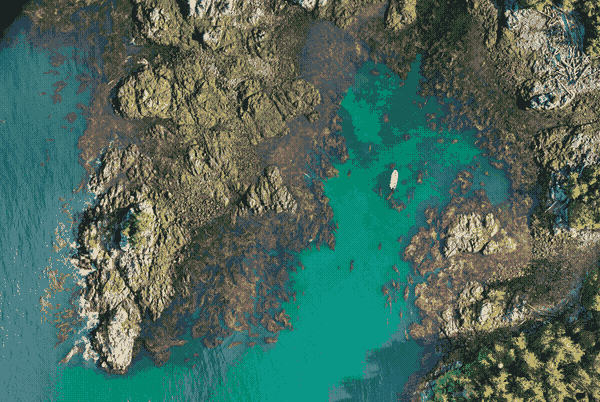

# Habitat-Mapper

<div style="overflow: hidden; display: flex; justify-content:flex-start; gap:10px;">
<a href="https://github.com/HakaiInstitute/habitat-mapper/actions/workflows/test.yml">
    
</a>

<a href="https://github.com/HakaiInstitute/habitat-mapper/blob/main/LICENSE">
    
</a>

<a href="https://pypi.org/project/habitat-mapper">
    
</a>

<a href="https://zenodo.org/badge/latestdoi/462897183">
    
</a>
</div>

{ loading=lazy }

**Habitat Segmentation with AI**

(The artist formerly known as *"Kelp-O-Matic"*)

***

## Features

* Kelp macrocystis/nereocystis detection in RGB and RGB+NIR RPAS and aerial imagery.
* Mussel and gooseneck barnacle detection in RGB RPAS imagery.
* Kelp presence/absence 8-band PlanetLabs satellite imagery.


## Quick Start (CLI)

1. Install Habitat-Mapper with Python pip
   ```bash
   pip install habitat-mapper
   ```
2. List the available models
   ```bash
   hab models
   ```
3. Segment your imagery (*e.g.* using the kelp-rgb model)
    ```bash
    hab segment kelp-rgb your_input_image.tif output_kelp.tif
    ```

## Getting Started

Check out our [beginner guide](beginner_guide/index.md) if you are new to using command line tools!

Otherwise, please see the [installation](installation.md) and the [CLI](cli.md) or [Python Library](python_lib.md) documentation.

## Contribute

If you encounter any trouble installing or using Habitat-Mapper, please
file a bug report using our
[GitHub Issue Tracker :material-github:](https://github.com/HakaiInstitute/habitat-mapper/issues) and we will do our
best to help or fix the issue.

Comments and questions are also appreciated!

## License

Habitat-Mapper is released under the
[MIT license](https://raw.githubusercontent.com/tayden/habitat-mapper/main/LICENSE).

## Contact

This project was co-created at the [Hakai Institute](https://hakai.org) by:

- [**Taylor Denouden**](mailto:taylor.denouden@hakai.org) *(Machine Learning, Software Development)*
- [**Luba Reshitnyk**](mailto:luba.reshitnyk@hakai.org) *(Scientific Application - Kelp, Data Collation and Labelling)*
- [**Will McInnes**](mailto:will.mcinnes@hakai.org) *(Data Collation and Labelling - Mussels)*
- [**Alyssa Gehman**](mailto:alyssa.gehman@hakai.org) *(Scientific Application - Mussels)*
