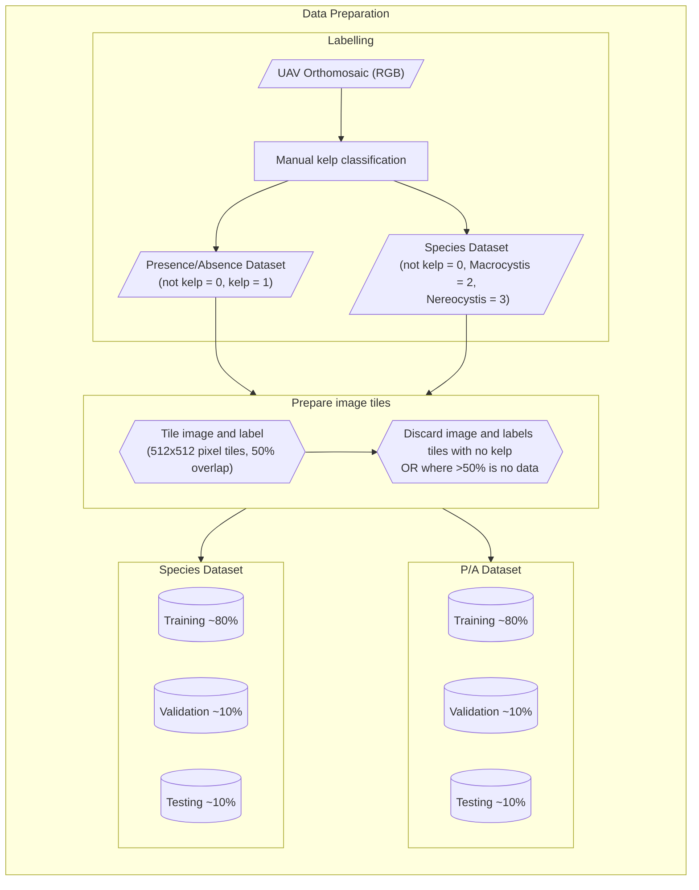
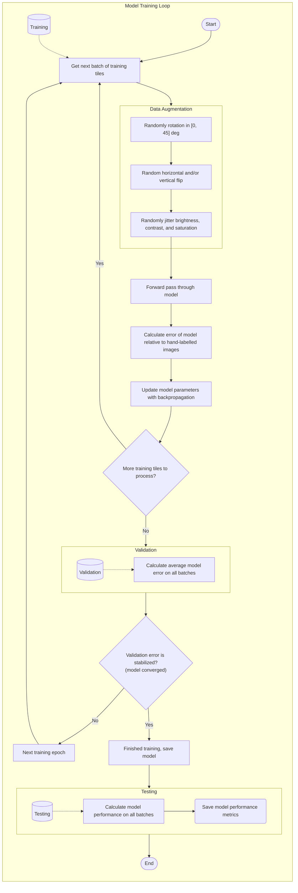

# Training Details

## Model Training Code

Model training code for most of the models is available in our
[GitHub repository :material-github:](https://github.com/HakaiInstitute/habitat-mapper).
Please note that this is an active project and documentation is provided on a best-effort basis.

## Dataset Preparation

The datasets used to train the kelp segmentation model were a number of scenes collected
using DJI Phantom remotely-piloted aircraft systems (RPAS). A total of 28 image mosaic
scenes were used. The resolution of each image varied between 0.023m and 0.428m, with
an average of 0.069m and standard deviation of 0.087m. These images were collected over
a period from 2018 to 2021, all during summer.

For model training, each dataset was divided into 512 pixels square cropped sections,
with 50% overlap between adjacent tiles. To balance the dataset, tiles containing no
kelp where discarded. These sets of tiles where then divided into training, validation,
and test splits.

Source code for data preparation is available on GitHub
at [:material-github: hakai-ml-dataprep](https://github.com/tayden/hakai-ml-dataprep).

### Pre-processing overview

### Dataset summaries

#### Kelp (presence/absence)

| Split      | Scenes |  Tiles | Pixels~kelp~ | Pixels~total~ | Area (km^2^) | Res~max~ (m) | Res~min~ (m) | Res~$\mu$~ (m) | Res~$\sigma$~ (m) |
|:-----------|-------:|-------:|-------------:|--------------:|-------------:|-------------:|-------------:|---------------:|------------------:|
| Train      |     20 | 829404 | 216770596954 |    3738528864 |     11680.54 |       0.1040 |       0.0230 |         0.0487 |            0.0253 |
| Validation |      4 |  31610 |   8220459464 |     295310084 |       253.79 |       0.0420 |       0.0230 |         0.0296 |            0.0085 |
| Test       |      6 |  92608 |  24093604354 |     639694012 |       819.45 |       0.0680 |       0.0230 |         0.0385 |            0.0161 |
| *Sum*      |     30 | 953622 | 249084660772 |    4673532960 |    12,753.78 |

#### Kelp (species)

| Split      | Scenes |  Tiles | Pixels~macro~ | Pixels~nereo~ | Pixels~total~ | Area (km^2^) | Res~max~ (m) | Res~min~ (m) | Res~$\mu$~ (m) | Res~$\sigma$~ (m) |
|:-----------|-------:|-------:|--------------:|--------------:|--------------:|-------------:|-------------:|-------------:|---------------:|------------------:|
| Train      |     17 | 336740 |     605462674 |    1158650042 |   88008624978 |      4034.11 |       0.1040 |       0.0230 |         0.0488 |            0.0266 |
| Validation |      4 |  15805 |     127410722 |      20244320 |    4110229732 |       123.91 |       0.0420 |       0.0230 |         0.0296 |            0.0085 |
| Test       |      6 |  46304 |     143277498 |     176569508 |   12046802177 |       409.72 |       0.0680 |       0.0230 |         0.0385 |            0.0161 |
| *Sum*      |     27 | 398849 |     876150894 |    1355463870 |  104165656887 |      4567.75 |              |              |                |                   |

#### Mussels (presence/absence)

| Split      | Scenes | Tiles | Pixels~mussels~ | Pixels~total~ | Area (km^2^) | Res~max~ (m) | Res~min~ (m) | Res~$\mu$~ (m) | Res~$\sigma$~ (m) |
|:-----------|-------:|------:|----------------:|--------------:|-------------:|-------------:|-------------:|---------------:|------------------:|
| Train      |     39 |  4834 |       933287123 |    5068816384 |      23.8147 |        0.027 |      0.00231 |      0.0082244 |        0.00492054 |
| Validation |      8 |  1277 |       223598444 |    1339031552 |      5.74255 |   0.00518591 |   0.00330667 |     0.00421985 |       0.000545617 |
| Test       |      8 |  1110 |       175226412 |    1163919360 |      4.64052 |   0.00578278 |     0.003671 |     0.00435929 |       0.000665025 |
| *Sum*      |     55 |  7221 |      1332111979 |    7571767296 |    34.197799 |     0.037969 |     0.009288 |       0.016804 |          0.006131 |

## Model Training

Source code for model training is available on GitHub
at [:material-github: hakai-ml-train](https://github.com/tayden/hakai-ml-train).

### Training overview

